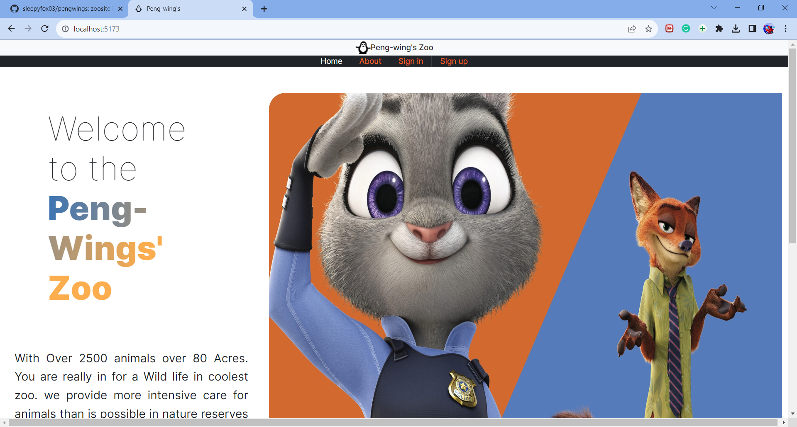
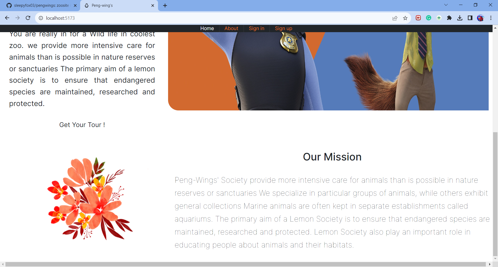
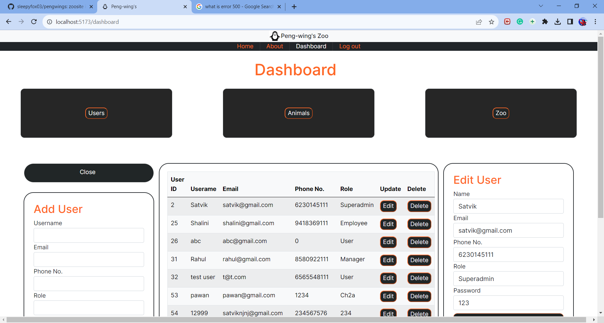
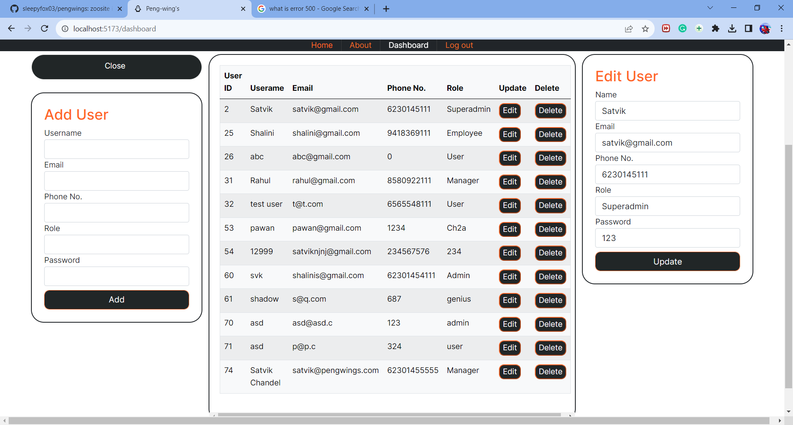
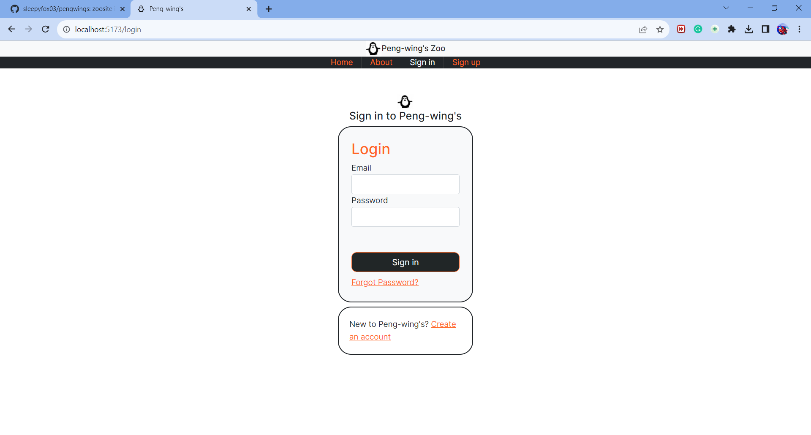
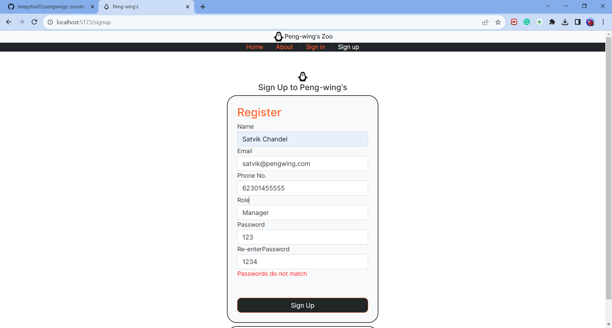
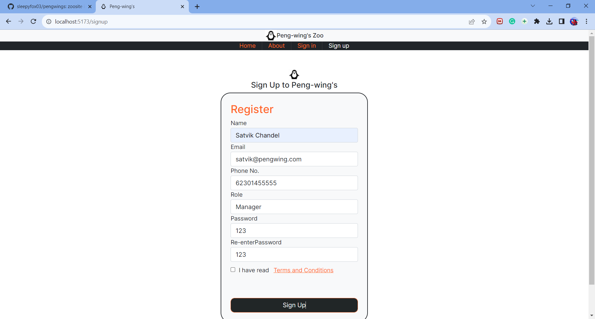

# zoo

This template should help get you started developing with Vue 3 in Vite.

## Website Gallery
 - - - -
__Home page__
This is the homepage of pengwings zoosite__


 - - - -
__Dashboard page__
This is the dashboard of our website which provides 3 options to view users, zoos and animals in the zoo. These buttons will view the tables and then we can perform crud operation on that table__


 - - - -
__Sign-in page__
This is the login of pengwings zoosite__

 - - - -
__Sign-up page__
This is the homepage of pengwings zoosite. The first image shows when passwords do not match then it wont show the terms and conditions checkbox and wont proceed to login.__



## Recommended IDE Setup

[VSCode](https://code.visualstudio.com/) + [Volar](https://marketplace.visualstudio.com/items?itemName=Vue.volar) (and disable Vetur) + [TypeScript Vue Plugin (Volar)](https://marketplace.visualstudio.com/items?itemName=Vue.vscode-typescript-vue-plugin).

## Customize configuration

See [Vite Configuration Reference](https://vitejs.dev/config/).

## Project Setup

```sh
npm install
```

### Compile and Hot-Reload for Development

```sh
npm run dev
```

### Compile and Minify for Production

```sh
npm run build
```
